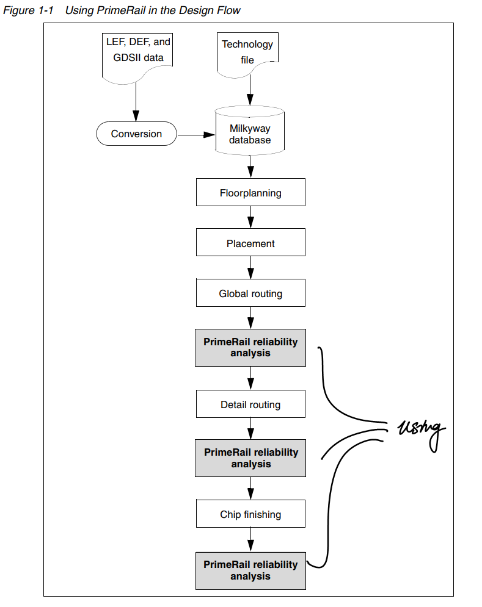

Example：PrimeTime Suite + PrimeRial
========================================
``PrimeTime Suite`` 提供了静态时序分析、功耗分析、功耗分析、信号完整性分析、process parameters 的统计偏差等多方面的分析

静态时序分析
--------------------

.. figure:: ./静态时序分析.png

PrimeTime VX
^^^^^^^^^^^^^^^^^^^^

``PrimeTime VX`` is a PrimeTime add-on feature that increases the accuracy of timing analysis by **considering the statistical variation and distribution of process parameters**.

``PrimeTime VX`` accurately determines the timing behavior of a circuit under varying parameters such as channel length, threshold voltage, and interconnect wire thickness.

Given a set of **variation-aware cell libraries and interconnect data**, PrimeTime VX analyzes path timing behavior under all combinations of parameter variations

功耗分析：PrimeTime PX
----------------------

``PrimeTime PX`` is a PrimeTime add-on feature that accurately **analyzes full-chip power dissipation of cell-based designs** 

- It provides vector-free and vector-based peak power and average power analysis. 
- The vectors to PrimeTime PX are either RTL or gate-level simulation results in Value Change Dump ( ``VCD`` ) format or Switching Activity Interchange Format ( ``SAIF`` )

信号完整性分析：PrimeTime SI
------------------------------
``PrimeTime SI`` (signal integrity) is a PrimeTime add-on feature that **adds crosstalk analysis capabilities** to PrimeTime static timing analyzer.

.. note::
    ``PrimeTime SI`` calculates the timing effects of cross-coupled capacitors between nets and includes the resulting delay changes in the PrimeTime analysis reports. It also calculates the logic effects of crosstalk noise and reports conditions that could lead to functional failure.

If you need to account for possible timing effects of crosstalk, using ``PrimeTime SI`` is much easier, faster, and more thorough than using a circuit simulator such as SPICE. 

Instead of analyzing just a single path or a few paths for crosstalk effects, ``PrimeTime SI`` lets you analyze the whole circuit using the familiar PrimeTime analysis flow

.. warning::
    
    To use PrimeTime SI with PrimeTime, you only need to do the following additional steps:
    
    - Enable PrimeTime SI by setting the ``si_enable_analysis`` variable to true.
    - **Back-annotate** the design with cross-coupling capacitor information, as specified in a Standard Parasitic Exchange Format ( ``SPEF`` ) file
    - Specify the parameters that determine the accuracy and speed of the crosstalk analysis effort, such as the number of analysis iterations and the capacitance values that can be safely ignored.

在完成寄生参数提取之后，进行反标工作再进行信号完整性分析

PrimeRial
-------------------

The ``PrimeRail`` tool is the Synopsys next generation **reliability** tool that provides both **time average and dynamic analysis capabilities in analyzing voltage (IR) drop or electromigration problems of the design** . 

The PrimeRail tool enables you to locate and eliminate possible voltage drop and electromigration violations for system-on-chip (SoC) designs. No matter what type of design it is, PrimeRail can provide accurate power rail analysis results with sign-off quality

