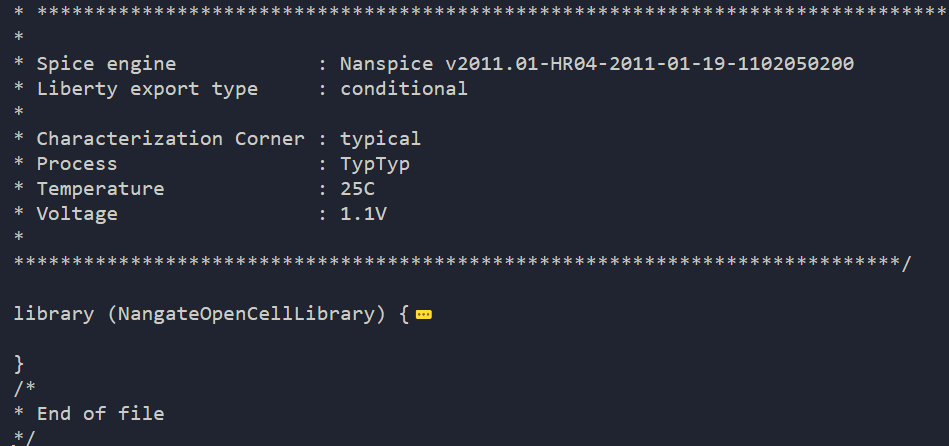

liberty library format
===================================

``liberty`` library format（以 ``.lib`` 结尾） 是由 Synopsys 公司开发的用于描述物理单元的时序、功耗信息的重要库文件，为了保证数据的精确性多采用 **非线性查找表** 或 **分段线性** 的方法。 由于电路的延时、功耗是输入信号斜率与输出负载的函数，完整的查找表有一维、二维、三维三种形式，分别表示一元、二元、三元三种函数关系

EDA 工具会在库文件中查找最符合单元真实情况的数据进行延时、功耗计算

.. warning::
    (**待调研**) 基于更为先进的 CCSM 、ECSM 模型建立的 ``liberty`` 不仅提高了纳米工艺下时序的精确度，还包含了对单元的噪声描述（:doc:`/chapter12/index`）
库名语句
-------------

库名语句：指定了库的名字，推荐将文件名和技术库的名字保持一致

.. code-block:: lib
    
    library (ex25) { /* start of library */
    < library deion >
    }/* end of library*/

在 ``< library deion >``  中包含具体的时序库信息

e.g.

库级属性
----------------------------

- 时序库的日期、注释、版本
- General Attributes
- 定义时间、电压、电流等物理量的单位
- 建立时序库的工艺、温度、电压、互连线模型，即定义库中的 **工作环境**（条件）集合，包括工艺、温度、电压和RC树模型信息。这些信息会在设计综合和时序分析时被采用

  - 一个库以采用的工作（操 作）条件为特征。在综合和时序分析时，如果如果指定了另一个工作环境的集合，则DC将根据指定的工作条件以K因子来减少延迟值。库开发者在库中可以定义任何数目的工作环境

- 时序范围模型：时序范围模型提供了计算信号到达时间的额外的能力，它是跟指定的工作环境有关的（下面的例子中没有）
- 线负载模型：线负载组包含了DC使用的在设计pre-layout phase 估计线互连延迟的一些信息。这些模型定义了电容，电阻和面积因素。另外，线负载组也指定了考虑中逻辑的slope 和 fanout_length 。电容、电阻和面积分别表示单位长度互连线的电容，电阻和面积

.. code-block ::

    /* Documentation Attributes：定义时序库的日期、注释、版本 */
    date                    		: "Thu 10 Feb 2011, 18:11:20";
    revision                		: "revision 1.0";
    comment                 		: "Copyright (c) 2004-2011 Nangate Inc. All Rights Reserved.";

    /* General Attributes */
    technology              		  (cmos);
    delay_model             		: table_lookup; //采用查找表延时模型来计算延时
    in_place_swap_mode      		: match_footprint;
    library_features        		  (report_delay_calculation,report_power_calculation);

    /* Units Attributes ： 定义时间、电压、电流等物理量的单位 */
    time_unit               		: "1ns";
    leakage_power_unit      		: "1nW";
    voltage_unit            		: "1V";
    current_unit            		: "1mA";
    pulling_resistance_unit 		: "1kohm";
    capacitive_load_unit    		  (1,ff);

    /* Operation Conditions ：建立时序库的工艺、温度、电压、互连线模型*/
    nom_process             		: 1.00;
    nom_temperature         		: 25.00;
    nom_voltage             		: 1.10;

    voltage_map (VDD,1.10);
    voltage_map (VSS,0.00);

    define(process_corner, operating_conditions, string);
    operating_conditions (typical) {
        process_corner	: "TypTyp";
        process       	: 1.00;
        voltage       	: 1.10;
        temperature   	: 25.00;
        tree_type     	: balanced_tree;//树类型的属性（tree_type ）定义了将要使用的环境互连模型
    }
    default_operating_conditions : typical;

    /* Threshold Definitions */

    input_threshold_pct_fall      	: 50.00 ;//定义延时模型
    input_threshold_pct_rise      	: 50.00 ;
    output_threshold_pct_fall     	: 50.00 ;
    output_threshold_pct_rise     	: 50.00 ;

    slew_lower_threshold_pct_fall 	: 30.00 ;//信号转换模型
    slew_lower_threshold_pct_rise 	: 30.00 ;
    slew_upper_threshold_pct_fall 	: 70.00 ;
    slew_upper_threshold_pct_rise 	: 70.00 ;
    slew_derate_from_library      	: 1.00 ;//未知？

    
    default_leakage_power_density 	: 0.00 ;//功耗参数
    default_cell_leakage_power    	: 0.00 ;

    /* Default Pin Attributes */
    default_inout_pin_cap       		: 1.000000;
    default_input_pin_cap       		: 1.000000;
    default_output_pin_cap      		: 0.000000;
    default_fanout_load         		: 1.000000;
    default_max_transition      		: 0.198535;

    define(drive_strength, cell, float);//未知？

    /* Wire load tables：互连线负载模板 */

    wire_load("1K_hvratio_1_4") {
        capacitance : 1.774000e-01;
        resistance : 3.571429e-03;
        slope : 5.000000;
        fanout_length( 1, 1.3207 );
        fanout_length( 2, 2.9813 );
        fanout_length( 3, 5.1135 );
        fanout_length( 4, 7.6639 );
        fanout_length( 5, 10.0334 );
        fanout_length( 6, 12.2296 );
        fanout_length( 8, 19.3185 );
    }

    wire_load("1K_hvratio_1_2"){
        ...
    }

    wire_load("1K_hvratio_1_2"){
        ...
    }

    /* 功耗模板 */
    power_lut_template (Hidden_power_7) {
        variable_1 : input_transition_time;
        index_1 ("0.0010,0.0020,0.0030,0.0040,0.0050,0.0060,0.0070");
    }

    power_lut_template (Power_7_7) {//二维功耗模板
        variable_1 : input_transition_time;
        variable_2 : total_output_net_capacitance;
        index_1 ("0.0010,0.0020,0.0030,0.0040,0.0050,0.0060,0.0070");
        index_2 ("0.0010,0.0020,0.0030,0.0040,0.0050,0.0060,0.0070");
    }

    ... // 其余功耗模板

    /* 时序延时模板 */
    lu_table_template (Hold_3_3) { // 二维时序延时模板
        variable_1 : constrained_pin_transition;
        variable_2 : related_pin_transition;
        index_1 ("0.0010,0.0020,0.0030");
        index_2 ("0.0010,0.0020,0.0030");
    }

    ... // 其余时序模板

组合单元描述
---------------------

.. code-block::

    /******************************************************************************************
    Module          	: AND2_X1
    Cell Description	: Combinational cell (AND2_X1) with drive strength X1
    *******************************************************************************************/

    cell (AND2_X1) {

    drive_strength     	: 1;

    /* 定义单元面积 */
    area               	: 1.064000;
    
    /* 定义引脚名称 */
    pg_pin(VDD) {
        voltage_name : VDD;
        pg_type      : primary_power;
    }
    pg_pin(VSS) {
        voltage_name : VSS;
        pg_type      : primary_ground;
    }

    /* 定义单元的泄漏功耗：列出不同输入信号组合的泄漏功耗 */
    cell_leakage_power 	: 25.066064;//功耗定义不完全时使用该值
        /* 定义依赖于不同输入信号组合的功耗 */
    leakage_power () {
        when           : "!A1 & !A2";
        value          : 20.324370;
    }
    leakage_power () {
        when           : "!A1 & A2";
        value          : 30.850688;
    }
    leakage_power () {
        when           : "A1 & !A2";
        value          : 20.622958;
    }
    leakage_power () {
        when           : "A1 & A2";
        value          : 28.466240;
    }

    /* 对单元端口 A1、A2、ZN 的定义 */
    pin (A1) {

        direction		: input;
        related_power_pin		: "VDD";
        related_ground_pin		: "VSS";
        capacitance		: 0.918145;
        fall_capacitance	: 0.874832;
        rise_capacitance	: 0.918145;
    }

    pin (A2) {

        direction		: input;
        related_power_pin		: "VDD";
        related_ground_pin		: "VSS";
        capacitance		: 0.974630;
        fall_capacitance	: 0.894119;
        rise_capacitance	: 0.974630;
    }

    pin (ZN) {

        direction		: output;
        related_power_pin	: "VDD";
        related_ground_pin	: "VSS";
        max_capacitance		: 60.577400;
        function		: "(A1 & A2)";

        /* 时序信息  */
        timing () {

            related_pin	   : "A1";
            timing_sense	   : positive_unate;// timing_sense 定义了输入影响输出的方式，positive_unate 表示 ZN 与 A1 正相关，即变化方向相同

            cell_fall(Timing_7_7) {//信号 ZN 下降的单元传播延时，Index_1 是输入信号 A1 的转换时间
                index_1 ("0.00117378,0.00472397,0.0171859,0.0409838,0.0780596,0.130081,0.198535");
                index_2 ("0.365616,1.893040,3.786090,7.572170,15.144300,30.288700,60.577400");
                values ("0.0217822,0.0253224,0.0288237,0.0346827,0.0448323,0.0636086,0.100366", \
                        "0.0233179,0.0268545,0.0303556,0.0362159,0.0463659,0.0651426,0.101902", \
                        "0.0296429,0.0331470,0.0366371,0.0425000,0.0526603,0.0714467,0.108208", \
                        "0.0402311,0.0440292,0.0477457,0.0538394,0.0641187,0.0829203,0.119654", \
                        "0.0511250,0.0554077,0.0595859,0.0662932,0.0771901,0.0963434,0.133061", \
                        "0.0625876,0.0673198,0.0719785,0.0794046,0.0910973,0.110757,0.147656", \
                        "0.0748282,0.0800098,0.0851434,0.0933663,0.106111,0.126669,0.163872");
            }
            cell_rise(Timing_7_7) {//信号 ZN 上升的单元传播延时，Index_1 是输入信号 A1 的转换时间
                index_1 ("0.00117378,0.00472397,0.0171859,0.0409838,0.0780596,0.130081,0.198535");
                index_2 ("0.365616,1.893040,3.786090,7.572170,15.144300,30.288700,60.577400");
                values ("0.0229273,0.0278833,0.0331544,0.0428051,0.0612642,0.0977350,0.170492", \
                        "0.0241796,0.0291333,0.0344028,0.0440520,0.0625091,0.0989835,0.171743", \
                        "0.0292313,0.0341494,0.0393813,0.0489834,0.0674111,0.103888,0.176663", \
                        "0.0361806,0.0413104,0.0466212,0.0562627,0.0746023,0.110992,0.183728", \
                        "0.0417222,0.0473804,0.0529449,0.0626244,0.0809404,0.117314,0.189941", \
                        "0.0458217,0.0520530,0.0581948,0.0682722,0.0865488,0.122733,0.195364", \
                        "0.0483588,0.0550898,0.0619209,0.0728347,0.0914012,0.127549,0.200020");
            }
            fall_transition(Timing_7_7) {//与输入信号A1相关的输出信号ZN下降的转换时间
                index_1 ("0.00117378,0.00472397,0.0171859,0.0409838,0.0780596,0.130081,0.198535");
                index_2 ("0.365616,1.893040,3.786090,7.572170,15.144300,30.288700,60.577400");
                values ("0.00449470,0.00613737,0.00800970,0.0116129,0.0188827,0.0341035,0.0656991", \
                        "0.00449457,0.00613918,0.00801067,0.0116136,0.0188830,0.0341032,0.0656996", \
                        "0.00452853,0.00617737,0.00804415,0.0116355,0.0188923,0.0341059,0.0656998", \
                        "0.00583601,0.00731234,0.00900023,0.0122896,0.0191954,0.0341882,0.0657049", \
                        "0.00766157,0.00916530,0.0108343,0.0139762,0.0204666,0.0348159,0.0657938", \
                        "0.00965692,0.0112246,0.0129530,0.0160624,0.0221739,0.0357885,0.0662734", \
                        "0.0119231,0.0135596,0.0153789,0.0185944,0.0245249,0.0373595,0.0668921");
            }
            rise_transition(Timing_7_7) {//与输入信号A1相关的输出信号ZN上升的转换时间
                index_1 ("0.00117378,0.00472397,0.0171859,0.0409838,0.0780596,0.130081,0.198535");
                index_2 ("0.365616,1.893040,3.786090,7.572170,15.144300,30.288700,60.577400");
                values ("0.00572880,0.00891685,0.0128187,0.0208943,0.0377688,0.0722247,0.141354", \
                        "0.00572757,0.00891940,0.0128191,0.0208911,0.0377733,0.0722335,0.141353", \
                        "0.00575739,0.00894876,0.0128462,0.0209084,0.0377703,0.0722407,0.141356", \
                        "0.00671156,0.00966231,0.0133885,0.0212253,0.0378500,0.0722258,0.141369", \
                        "0.00818272,0.0110287,0.0143519,0.0217385,0.0381954,0.0723902,0.141349", \
                        "0.00991536,0.0129659,0.0161539,0.0228147,0.0385411,0.0726187,0.141516", \
                        "0.0119755,0.0151970,0.0186081,0.0248105,0.0395074,0.0729589,0.141761");
            }
        }

        timing () {

            related_pin	   : "A2";
            timing_sense	   : positive_unate;

            cell_fall(Timing_7_7) {
                index_1 ("0.00117378,0.00472397,0.0171859,0.0409838,0.0780596,0.130081,0.198535");
                index_2 ("0.365616,1.893040,3.786090,7.572170,15.144300,30.288700,60.577400");
                values ("0.0239949,0.0275975,0.0311598,0.0371031,0.0473463,0.0662033,0.103011", \
                        "0.0255669,0.0291678,0.0327291,0.0386739,0.0489182,0.0677760,0.104585", \
                        "0.0319701,0.0355491,0.0391003,0.0450456,0.0552974,0.0741632,0.110978", \
                        "0.0434655,0.0472450,0.0509446,0.0570185,0.0673368,0.0862117,0.123012", \
                        "0.0556722,0.0599286,0.0640715,0.0707302,0.0816015,0.100770,0.137535", \
                        "0.0685793,0.0732749,0.0778555,0.0851681,0.0967322,0.116339,0.153273", \
                        "0.0826468,0.0877448,0.0927479,0.100713,0.113127,0.133390,0.170486");
            }
            cell_rise(Timing_7_7) {
                index_1 ("0.00117378,0.00472397,0.0171859,0.0409838,0.0780596,0.130081,0.198535");
                index_2 ("0.365616,1.893040,3.786090,7.572170,15.144300,30.288700,60.577400");
                values ("0.0242401,0.0291962,0.0344675,0.0441201,0.0625805,0.0990542,0.171801", \
                        "0.0255584,0.0305130,0.0357827,0.0454343,0.0638975,0.100369,0.173119", \
                        "0.0294291,0.0343648,0.0396144,0.0492411,0.0676866,0.104173,0.176930", \
                        "0.0349546,0.0400471,0.0453740,0.0550447,0.0734601,0.109904,0.182664", \
                        "0.0400649,0.0454754,0.0509759,0.0607322,0.0791520,0.115586,0.188291", \
                        "0.0437777,0.0496859,0.0555709,0.0656195,0.0841134,0.120470,0.193165", \
                        "0.0457090,0.0521251,0.0585676,0.0691868,0.0880108,0.124497,0.197148");
            }
            fall_transition(Timing_7_7) {
                index_1 ("0.00117378,0.00472397,0.0171859,0.0409838,0.0780596,0.130081,0.198535");
                index_2 ("0.365616,1.893040,3.786090,7.572170,15.144300,30.288700,60.577400");
                values ("0.00471394,0.00634454,0.00821102,0.0117966,0.0190382,0.0342159,0.0657737", \
                        "0.00471391,0.00634604,0.00821227,0.0117981,0.0190383,0.0342154,0.0657720", \
                        "0.00472858,0.00636732,0.00823258,0.0118121,0.0190443,0.0342171,0.0657739", \
                        "0.00577932,0.00724331,0.00893038,0.0122586,0.0192546,0.0342798,0.0657801", \
                        "0.00756354,0.00903153,0.0106837,0.0138481,0.0203985,0.0348060,0.0658584", \
                        "0.00942122,0.0109441,0.0126352,0.0157346,0.0219195,0.0356900,0.0662760", \
                        "0.0114239,0.0129875,0.0147361,0.0178899,0.0238428,0.0368950,0.0667496");
            }
            rise_transition(Timing_7_7) {
                index_1 ("0.00117378,0.00472397,0.0171859,0.0409838,0.0780596,0.130081,0.198535");
                index_2 ("0.365616,1.893040,3.786090,7.572170,15.144300,30.288700,60.577400");
                values ("0.00572830,0.00891869,0.0128184,0.0208944,0.0377764,0.0722278,0.141362", \
                        "0.00572847,0.00891651,0.0128194,0.0208942,0.0377760,0.0722301,0.141366", \
                        "0.00574608,0.00893558,0.0128334,0.0209016,0.0377751,0.0722257,0.141362", \
                        "0.00624225,0.00936830,0.0131855,0.0211105,0.0378266,0.0722281,0.141368", \
                        "0.00717298,0.0102127,0.0138473,0.0215165,0.0380542,0.0723155,0.141361", \
                        "0.00848158,0.0115952,0.0150567,0.0223372,0.0384207,0.0724943,0.141439", \
                        "0.0100150,0.0133287,0.0168266,0.0237260,0.0392895,0.0729088,0.141632");
            }
        }

        /* 单元内部功耗 */
        internal_power () {

            related_pin	         : "A1";
            fall_power(Power_7_7) {// 当输入信号 A2 等于 1，输入信号 A1 在不同转换时间下，端口ZN信号信号下降所消耗的内部功耗
                index_1 ("0.00117378,0.00472397,0.0171859,0.0409838,0.0780596,0.130081,0.198535");
                index_2 ("0.365616,1.893040,3.786090,7.572170,15.144300,30.288700,60.577400");
                values ("2.707163,2.939134,3.111270,3.271119,3.366153,3.407657,3.420511", \
                        "2.676697,2.905713,3.073189,3.236823,3.334156,3.373344,3.387400", \
                        "2.680855,2.891263,3.047784,3.212948,3.315296,3.360694,3.377614", \
                        "2.821141,3.032707,3.182020,3.338567,3.444608,3.488752,3.508229", \
                        "3.129641,3.235525,3.357993,3.567372,3.743682,3.792092,3.808289", \
                        "3.724304,3.738737,3.808381,3.980825,4.147999,4.278043,4.311323", \
                        "4.526175,4.492292,4.510220,4.634217,4.814899,4.934862,5.047389");
            }
            rise_power(Power_7_7) {// 当输入信号 A2 等于 1，输入信号 A1 在不同转换时间下，端口ZN信号信号上升所消耗的内部功耗
                index_1 ("0.00117378,0.00472397,0.0171859,0.0409838,0.0780596,0.130081,0.198535");
                index_2 ("0.365616,1.893040,3.786090,7.572170,15.144300,30.288700,60.577400");
                values ("1.823439,1.926997,1.963153,2.028865,1.957837,2.123314,2.075262", \
                        "1.796317,1.896145,1.960625,2.014112,2.050786,2.046472,1.972327", \
                        "1.811604,1.886741,1.955658,1.978263,1.965671,1.963736,2.071227", \
                        "1.997387,2.045930,2.092357,2.063643,2.099127,1.932089,2.131341", \
                        "2.367285,2.439718,2.440043,2.403446,2.305848,2.351146,2.195145", \
                        "2.916140,2.994325,3.044451,2.962881,2.836259,2.781564,2.633645", \
                        "3.687718,3.756085,3.789394,3.792984,3.773583,3.593022,3.405552");
            }
        }

        internal_power () {

            related_pin	         : "A2";
            fall_power(Power_7_7) {// 当输入信号 A1 等于 1，输入信号 A2 在不同转换时间下，端口ZN信号信号下降所消耗的内部功耗
                index_1 ("0.00117378,0.00472397,0.0171859,0.0409838,0.0780596,0.130081,0.198535");
                index_2 ("0.365616,1.893040,3.786090,7.572170,15.144300,30.288700,60.577400");
                values ("3.037418,3.256810,3.431183,3.608914,3.718690,3.769096,3.795202", \
                        "3.008434,3.225727,3.401854,3.575115,3.690150,3.744665,3.770126", \
                        "3.019161,3.227246,3.396745,3.567796,3.687272,3.742217,3.772264", \
                        "3.209283,3.383153,3.545968,3.708113,3.823034,3.876287,3.908345", \
                        "3.515341,3.612604,3.759132,3.957421,4.125916,4.183148,4.215191", \
                        "4.067419,4.111031,4.206104,4.363313,4.545920,4.679285,4.713087", \
                        "4.900192,4.882841,4.918321,5.018351,5.199236,5.309747,5.420047");
            }
            rise_power(Power_7_7) {// 当输入信号 A1 等于 1，输入信号 A2 在不同转换时间下，端口ZN信号信号下降所消耗的内部功耗
                index_1 ("0.00117378,0.00472397,0.0171859,0.0409838,0.0780596,0.130081,0.198535");
                index_2 ("0.365616,1.893040,3.786090,7.572170,15.144300,30.288700,60.577400");
                values ("1.826567,1.923081,1.948203,2.039180,2.076657,2.044749,1.913708", \
                        "1.800512,1.903364,1.974517,2.016468,2.024243,1.959196,1.817329", \
                        "1.781119,1.870353,1.937484,1.966376,2.010382,1.978551,1.849007", \
                        "1.856892,1.933118,1.937117,1.991598,2.024542,1.995340,1.788981", \
                        "2.103379,2.174172,2.204352,2.188346,2.094260,2.063115,2.133599", \
                        "2.500764,2.607899,2.629193,2.623620,2.539760,2.417873,2.489576", \
                        "3.041217,3.139373,3.221432,3.253461,3.258340,3.164002,3.111013");
            }
        }
    }

    }

时序单元描述
-----------------------

.. code-block::

    /******************************************************************************************
    Module          	: DFF_X1
    Cell Description	: Pos.edge D-Flip-Flop with drive strength X1
    *******************************************************************************************/

    cell (DFF_X1) {

    drive_strength     	: 1;//? 驱动力

    ff ("IQ" , "IQN") {             // IQ 是触发器输入信号的非反相输出端， IQN 是触发器的反向输出端
        next_state         	: "D";  // 定义时钟有效时，触发器输出信号
        clocked_on         	: "CK"; // 定义触发器时钟信号上升沿有效
    }

    area               	: 4.522000;
    pg_pin(VDD) {
        voltage_name : VDD;
        pg_type      : primary_power;
    }
    pg_pin(VSS) {
        voltage_name : VSS;
        pg_type      : primary_ground;
    }

    cell_leakage_power 	: 79.112308;

    leakage_power () {
        when           : "!CK & !D & !Q & QN";
        value          : 73.812310;
    }
    leakage_power () {
        when           : "!CK & !D & Q & !QN";
        value          : 77.650980;
    }
    leakage_power () {
        when           : "!CK & D & !Q & QN";
        value          : 84.084352;
    }
    leakage_power () {
        when           : "!CK & D & Q & !QN";
        value          : 82.786902;
    }
    leakage_power () {
        when           : "CK & !D & !Q & QN";
        value          : 78.328514;
    }
    leakage_power () {
        when           : "CK & !D & Q & !QN";
        value          : 68.431484;
    }
    leakage_power () {
        when           : "CK & D & !Q & QN";
        value          : 92.268539;
    }
    leakage_power () {
        when           : "CK & D & Q & !QN";
        value          : 75.535383;
    }

    /* 针对 D 端口进行定义 */
    pin (D) {

        direction		: input;
        related_power_pin		: "VDD";
        related_ground_pin		: "VSS";
        capacitance		: 1.140290;
        fall_capacitance	: 1.062342;
        rise_capacitance	: 1.140290;

        /* 定义 CK 的上升沿用于 hold 时间检查 */
        timing () {

            related_pin	   : "CK";
            timing_type	   : hold_rising;
            fall_constraint(Hold_3_3) { // 定义输入端口 D 从高电平转化到低电平的 hold 时间
                index_1 ("0.00117378,0.0449324,0.198535");
                index_2 ("0.00117378,0.0449324,0.198535");
                values ("0.001650,0.010970,0.010626", \
                        "0.004131,0.010748,0.006379", \
                        "0.143222,0.153005,0.144764");
            }
            rise_constraint(Hold_3_3) { // 定义输入端口 D 从低电平转化到高电平的 hold 时间
                index_1 ("0.00117378,0.0449324,0.198535");
                index_2 ("0.00117378,0.0449324,0.198535");
                values ("0.003805,0.015977,0.020421", \
                        "0.016803,0.029868,0.034184", \
                        "0.098513,0.113992,0.121949");
            }
        }

        /* 定义 CK 的上升沿用于 setup 时间检查 */
        timing () {

            related_pin	   : "CK";
            timing_type	   : setup_rising;
            fall_constraint(Setup_3_3) { // 定义输入端口 D 从高电平转化到低电平的 setup 时间
                index_1 ("0.00117378,0.0449324,0.198535");
                index_2 ("0.00117378,0.0449324,0.198535");
                values ("0.036831,0.022224,0.015916", \
                        "0.054595,0.039810,0.033507", \
                        "0.100487,0.085013,0.077078");
            }
            rise_constraint(Setup_3_3) { // 定义输入端口 D 从低电平转化到高电平的 setup 时间
                index_1 ("0.00117378,0.0449324,0.198535");
                index_2 ("0.00117378,0.0449324,0.198535");
                values ("0.029299,0.024425,0.037712", \
                        "0.041187,0.034581,0.045743", \
                        "0.055773,0.045995,0.054260");
            }
        }

        internal_power () {

            when          	: "!CK & !Q & QN";

            fall_power(Hidden_power_7) {
                index_1 ("0.00117378,0.00472397,0.0171859,0.0409838,0.0780596,0.130081,0.198535");
                values ("4.282350,4.262724,4.232647,4.257524,4.440015,4.830113,5.453793");
            }
            rise_power(Hidden_power_7) {
                index_1 ("0.00117378,0.00472397,0.0171859,0.0409838,0.0780596,0.130081,0.198535");
                values ("3.123160,3.087455,3.057099,3.089699,3.264636,3.641862,4.248752");
            }

        }

        internal_power () {

            when          	: "!CK & Q & !QN";

            fall_power(Hidden_power_7) {
                index_1 ("0.00117378,0.00472397,0.0171859,0.0409838,0.0780596,0.130081,0.198535");
                values ("4.225775,4.204949,4.176186,4.201258,4.386545,4.779222,5.403637");
            }
            rise_power(Hidden_power_7) {
                index_1 ("0.00117378,0.00472397,0.0171859,0.0409838,0.0780596,0.130081,0.198535");
                values ("3.083037,3.048137,3.017534,3.048552,3.218148,3.591164,4.190437");
            }

        }

        internal_power () {

            when          	: "CK & !Q & QN";

            fall_power(Hidden_power_7) {
                index_1 ("0.00117378,0.00472397,0.0171859,0.0409838,0.0780596,0.130081,0.198535");
                values ("0.734644,0.711876,0.699974,0.693873,0.690560,0.688463,0.686629");
            }
            rise_power(Hidden_power_7) {
                index_1 ("0.00117378,0.00472397,0.0171859,0.0409838,0.0780596,0.130081,0.198535");
                values ("-0.629039,-0.632808,-0.635332,-0.637084,-0.638669,-0.639510,-0.640648");
            }

        }

        internal_power () {

            when          	: "CK & Q & !QN";

            fall_power(Hidden_power_7) {
                index_1 ("0.00117378,0.00472397,0.0171859,0.0409838,0.0780596,0.130081,0.198535");
                values ("0.649761,0.657430,0.659383,0.658763,0.658012,0.657721,0.657131");
            }
            rise_power(Hidden_power_7) {
                index_1 ("0.00117378,0.00472397,0.0171859,0.0409838,0.0780596,0.130081,0.198535");
                values ("-0.433510,-0.498326,-0.553300,-0.573050,-0.585298,-0.593057,-0.598187");
            }

        }
    }

    pin (CK) {

        direction		: input;
        related_power_pin		: "VDD";
        related_ground_pin		: "VSS";
        clock   		: true;
        capacitance		: 0.949653;
        fall_capacitance	: 0.856440;
        rise_capacitance	: 0.949653;

        timing () {

            related_pin	   : "CK";
            timing_type	   : min_pulse_width;
            fall_constraint(Pulse_width_3) {
                index_1 ("0.00117378,0.0449324,0.198535");
                values ("0.052454,0.068941,0.198733");
            }
            rise_constraint(Pulse_width_3) {
                index_1 ("0.00117378,0.0449324,0.198535");
                values ("0.052454,0.055730,0.198733");
            }
        }

        internal_power () {

            when          	: "!D & !Q & QN";

            fall_power(Hidden_power_7) {
                index_1 ("0.00117378,0.00472397,0.0171859,0.0409838,0.0780596,0.130081,0.198535");
                values ("4.497803,4.465589,4.474442,4.653631,5.024863,5.612265,6.462059");
            }
            rise_power(Hidden_power_7) {
                index_1 ("0.00117378,0.00472397,0.0171859,0.0409838,0.0780596,0.130081,0.198535");
                values ("2.441622,2.424683,2.419478,2.538300,2.868236,3.458473,4.350696");
            }

        }

        internal_power () {

            when          	: "!D & Q & !QN";

            fall_power(Hidden_power_7) {
                index_1 ("0.00117378,0.00472397,0.0171859,0.0409838,0.0780596,0.130081,0.198535");
                values ("7.580013,7.545830,7.553889,7.732922,8.104180,8.689834,9.534370");
            }
            rise_power(scalar) {values ("0.0");
            }

        }

        internal_power () {

            when          	: "D & !Q & QN";

            fall_power(Hidden_power_7) {
                index_1 ("0.00117378,0.00472397,0.0171859,0.0409838,0.0780596,0.130081,0.198535");
                values ("7.539890,7.504660,7.510408,7.700613,8.104432,8.735168,9.638019");
            }
            rise_power(scalar) {values ("0.0");
            }

        }

        internal_power () {

            when          	: "D & Q & !QN";

            fall_power(Hidden_power_7) {
                index_1 ("0.00117378,0.00472397,0.0171859,0.0409838,0.0780596,0.130081,0.198535");
                values ("4.265302,4.236623,4.243058,4.421492,4.793004,5.381130,6.226269");
            }
            rise_power(Hidden_power_7) {
                index_1 ("0.00117378,0.00472397,0.0171859,0.0409838,0.0780596,0.130081,0.198535");
                values ("2.627385,2.610493,2.608469,2.730149,3.052950,3.639302,4.526135");
            }

        }
    }

    pin (Q) {

        direction		: output;
        related_power_pin	: "VDD";
        related_ground_pin	: "VSS";
        max_capacitance		: 60.730000;
        function		: "IQ";

        timing () {

            related_pin	   : "CK";
            timing_type	   : rising_edge;
            timing_sense	   : non_unate;

            cell_fall(Timing_7_7) {
                index_1 ("0.00117378,0.00472397,0.0171859,0.0409838,0.0780596,0.130081,0.198535");
                index_2 ("0.365616,1.897810,3.795620,7.591250,15.182500,30.365000,60.730000");
                values ("0.0766596,0.0798075,0.0830620,0.0887201,0.0987256,0.117420,0.154208", \
                        "0.0781451,0.0812961,0.0845506,0.0902064,0.100214,0.118901,0.155689", \
                        "0.0834509,0.0865996,0.0898538,0.0955104,0.105520,0.124208,0.161007", \
                        "0.0898134,0.0929656,0.0962190,0.101880,0.111891,0.130580,0.167368", \
                        "0.0948029,0.0979521,0.101199,0.106852,0.116848,0.135526,0.172330", \
                        "0.0980374,0.101184,0.104444,0.110089,0.120091,0.138781,0.175556", \
                        "0.0991226,0.102262,0.105515,0.111166,0.121175,0.139862,0.176647");
            }
            cell_rise(Timing_7_7) {
                index_1 ("0.00117378,0.00472397,0.0171859,0.0409838,0.0780596,0.130081,0.198535");
                index_2 ("0.365616,1.897810,3.795620,7.591250,15.182500,30.365000,60.730000");
                values ("0.0828120,0.0863005,0.0900538,0.0980799,0.115488,0.151502,0.224142", \
                        "0.0843002,0.0877892,0.0915421,0.0995682,0.116978,0.152987,0.225636", \
                        "0.0894747,0.0929639,0.0967178,0.104737,0.122148,0.158157,0.230802", \
                        "0.0956394,0.0991291,0.102879,0.110903,0.128306,0.164314,0.236967", \
                        "0.100388,0.103879,0.107634,0.115656,0.133046,0.169055,0.241706", \
                        "0.103693,0.107179,0.110951,0.118968,0.136339,0.172342,0.244989", \
                        "0.105393,0.108883,0.112684,0.120677,0.138011,0.173995,0.246637");
            }
            fall_transition(Timing_7_7) {
                index_1 ("0.00117378,0.00472397,0.0171859,0.0409838,0.0780596,0.130081,0.198535");
                index_2 ("0.365616,1.897810,3.795620,7.591250,15.182500,30.365000,60.730000");
                values ("0.00509944,0.00667713,0.00843811,0.0118927,0.0190266,0.0342192,0.0659466", \
                        "0.00509868,0.00668041,0.00844158,0.0118927,0.0190271,0.0342175,0.0659329", \
                        "0.00509874,0.00668007,0.00844172,0.0118938,0.0190260,0.0342101,0.0659479", \
                        "0.00510320,0.00667800,0.00844104,0.0118947,0.0190254,0.0342112,0.0659275", \
                        "0.00510062,0.00667299,0.00843851,0.0118941,0.0190265,0.0342181,0.0659411", \
                        "0.00510293,0.00667931,0.00844589,0.0118941,0.0190310,0.0342213,0.0659159", \
                        "0.00510747,0.00668127,0.00844377,0.0118974,0.0190248,0.0342139,0.0659304");
            }
            rise_transition(Timing_7_7) {
                index_1 ("0.00117378,0.00472397,0.0171859,0.0409838,0.0780596,0.130081,0.198535");
                index_2 ("0.365616,1.897810,3.795620,7.591250,15.182500,30.365000,60.730000");
                values ("0.00623451,0.00895183,0.0123373,0.0202600,0.0373722,0.0719784,0.141272", \
                        "0.00623484,0.00895495,0.0123329,0.0202604,0.0373685,0.0719779,0.141269", \
                        "0.00623822,0.00895003,0.0123317,0.0202595,0.0373725,0.0719774,0.141268", \
                        "0.00624078,0.00895914,0.0123355,0.0202606,0.0373701,0.0719776,0.141269", \
                        "0.00624423,0.00896103,0.0123353,0.0202645,0.0373728,0.0719740,0.141265", \
                        "0.00624876,0.00896943,0.0123402,0.0202634,0.0373720,0.0719776,0.141271", \
                        "0.00627065,0.00898833,0.0123576,0.0202666,0.0373714,0.0719777,0.141271");
            }
        }

        internal_power () {

            related_pin	         : "CK";
            fall_power(Power_7_7) {
                index_1 ("0.00117378,0.00472397,0.0171859,0.0409838,0.0780596,0.130081,0.198535");
                index_2 ("0.365616,1.897810,3.795620,7.591250,15.182500,30.365000,60.730000");
                values ("3.976646,4.055223,4.115315,4.258488,4.315315,4.372446,4.284551", \
                        "3.960900,4.039375,4.093985,4.247803,4.298686,4.362464,4.242090", \
                        "3.961073,4.034732,4.093420,4.250343,4.314382,4.307469,4.371643", \
                        "4.027238,4.102224,4.169560,4.322728,4.386049,4.407954,4.439979", \
                        "4.183792,4.263914,4.327710,4.478893,4.558656,4.584350,4.553607", \
                        "4.496796,4.579863,4.619351,4.782886,4.821955,4.868241,4.886405", \
                        "4.940885,5.010195,5.068653,5.252005,5.313253,5.302025,5.261229");
            }
            rise_power(Power_7_7) {
                index_1 ("0.00117378,0.00472397,0.0171859,0.0409838,0.0780596,0.130081,0.198535");
                index_2 ("0.365616,1.897810,3.795620,7.591250,15.182500,30.365000,60.730000");
                values ("4.357977,4.355108,4.344618,4.381384,4.417019,4.381589,4.469754", \
                        "4.349755,4.337047,4.334989,4.387289,4.395348,4.364141,4.471032", \
                        "4.354155,4.307118,4.302735,4.369440,4.413914,4.398943,4.329968", \
                        "4.404122,4.381596,4.379717,4.426014,4.449847,4.464205,4.516372", \
                        "4.577598,4.559692,4.544906,4.583244,4.628942,4.665534,4.674996", \
                        "4.890110,4.873307,4.869868,4.903053,4.944075,4.950879,4.978803", \
                        "5.343092,5.333614,5.326871,5.351517,5.389055,5.414645,5.293971");
            }
        }
    }

    pin (QN) {

        direction		: output;
        related_power_pin	: "VDD";
        related_ground_pin	: "VSS";
        max_capacitance		: 60.272200;
        function		: "IQN";

        timing () {

            related_pin	   : "CK";
            timing_type	   : rising_edge;
            timing_sense	   : non_unate;

            cell_fall(Timing_7_7) {
                index_1 ("0.00117378,0.00472397,0.0171859,0.0409838,0.0780596,0.130081,0.198535");
                index_2 ("0.365616,1.883510,3.767010,7.534020,15.068000,30.136100,60.272200");
                values ("0.0590814,0.0641353,0.0692419,0.0776560,0.0912053,0.113128,0.151601", \
                        "0.0605694,0.0656230,0.0707299,0.0791437,0.0926937,0.114615,0.153088", \
                        "0.0657407,0.0707927,0.0759037,0.0843106,0.0978665,0.119791,0.158265", \
                        "0.0719044,0.0769538,0.0820603,0.0904739,0.104026,0.125953,0.164434", \
                        "0.0766420,0.0816925,0.0868001,0.0952197,0.108774,0.130711,0.169201", \
                        "0.0799325,0.0849784,0.0901025,0.0985159,0.112059,0.134004,0.172481", \
                        "0.0815711,0.0866232,0.0917836,0.100197,0.113738,0.135703,0.174209");
            }
            cell_rise(Timing_7_7) {
                index_1 ("0.00117378,0.00472397,0.0171859,0.0409838,0.0780596,0.130081,0.198535");
                index_2 ("0.365616,1.883510,3.767010,7.534020,15.068000,30.136100,60.272200");
                values ("0.0579281,0.0631326,0.0686824,0.0787075,0.0975014,0.133960,0.206399", \
                        "0.0594181,0.0646204,0.0701709,0.0801938,0.0989883,0.135442,0.207884", \
                        "0.0647200,0.0699237,0.0754737,0.0854982,0.104290,0.140751,0.213191", \
                        "0.0710810,0.0762880,0.0818388,0.0918690,0.110663,0.147123,0.219564", \
                        "0.0760682,0.0812757,0.0868194,0.0968453,0.115629,0.152078,0.224531", \
                        "0.0792933,0.0844982,0.0900503,0.100076,0.118866,0.155320,0.227752", \
                        "0.0803694,0.0855744,0.0911261,0.101151,0.119947,0.156400,0.228839");
            }
            fall_transition(Timing_7_7) {
                index_1 ("0.00117378,0.00472397,0.0171859,0.0409838,0.0780596,0.130081,0.198535");
                index_2 ("0.365616,1.883510,3.767010,7.534020,15.068000,30.136100,60.272200");
                values ("0.00987208,0.0119379,0.0142372,0.0183892,0.0255977,0.0393357,0.0684911", \
                        "0.00987294,0.0119384,0.0142378,0.0183897,0.0255990,0.0393330,0.0684946", \
                        "0.00988089,0.0119465,0.0142442,0.0183961,0.0256002,0.0393374,0.0685005", \
                        "0.00988471,0.0119546,0.0142515,0.0184041,0.0256072,0.0393424,0.0684990", \
                        "0.00991211,0.0119842,0.0142823,0.0184347,0.0256336,0.0393498,0.0684990", \
                        "0.00995525,0.0120266,0.0143251,0.0184698,0.0256588,0.0393689,0.0685028", \
                        "0.0101103,0.0121673,0.0144543,0.0185827,0.0257443,0.0394207,0.0685402");
            }
            rise_transition(Timing_7_7) {
                index_1 ("0.00117378,0.00472397,0.0171859,0.0409838,0.0780596,0.130081,0.198535");
                index_2 ("0.365616,1.883510,3.767010,7.534020,15.068000,30.136100,60.272200");
                values ("0.00708298,0.0103508,0.0142824,0.0222811,0.0387488,0.0725710,0.141217", \
                        "0.00708276,0.0103506,0.0142838,0.0222814,0.0387469,0.0725720,0.141210", \
                        "0.00707927,0.0103482,0.0142864,0.0222810,0.0387407,0.0725745,0.141219", \
                        "0.00708388,0.0103534,0.0142872,0.0222818,0.0387423,0.0725732,0.141210", \
                        "0.00708667,0.0103571,0.0142903,0.0222825,0.0387431,0.0725738,0.141211", \
                        "0.00710286,0.0103657,0.0142966,0.0222906,0.0387527,0.0725748,0.141215", \
                        "0.00711448,0.0103775,0.0143072,0.0222975,0.0387554,0.0725759,0.141223");
            }
        }

        internal_power () {

            related_pin	         : "CK";
            fall_power(Power_7_7) {
                index_1 ("0.00117378,0.00472397,0.0171859,0.0409838,0.0780596,0.130081,0.198535");
                index_2 ("0.365616,1.883510,3.767010,7.534020,15.068000,30.136100,60.272200");
                values ("4.357973,4.354002,4.350129,4.382491,4.438811,4.426742,4.390698", \
                        "4.349747,4.346172,4.343441,4.360171,4.417402,4.429651,4.462806", \
                        "4.352509,4.306565,4.340207,4.380166,4.388588,4.423723,4.420258", \
                        "4.404120,4.384692,4.397729,4.428853,4.478215,4.508593,4.507068", \
                        "4.577598,4.561729,4.558933,4.594070,4.650533,4.566911,4.679492", \
                        "4.890103,4.876413,4.869619,4.899779,4.893542,4.883107,4.955819", \
                        "5.341252,5.336669,5.332610,5.377127,5.413392,5.353877,5.384633");
            }
            rise_power(Power_7_7) {
                index_1 ("0.00117378,0.00472397,0.0171859,0.0409838,0.0780596,0.130081,0.198535");
                index_2 ("0.365616,1.883510,3.767010,7.534020,15.068000,30.136100,60.272200");
                values ("3.976661,4.057400,4.116970,4.258121,4.324128,4.274664,4.374090", \
                        "3.960705,4.043382,4.107914,4.249031,4.303229,4.349838,4.317820", \
                        "3.961932,4.037292,4.096452,4.261011,4.305124,4.324168,4.383075", \
                        "4.020823,4.103340,4.157233,4.310159,4.394485,4.412408,4.360981", \
                        "4.179444,4.264552,4.332909,4.484011,4.509648,4.576835,4.556156", \
                        "4.496807,4.568296,4.638686,4.775179,4.850398,4.864834,4.807024", \
                        "4.940842,5.010481,5.083404,5.229591,5.300427,5.300514,5.350649");
            }
        }
    }

    }