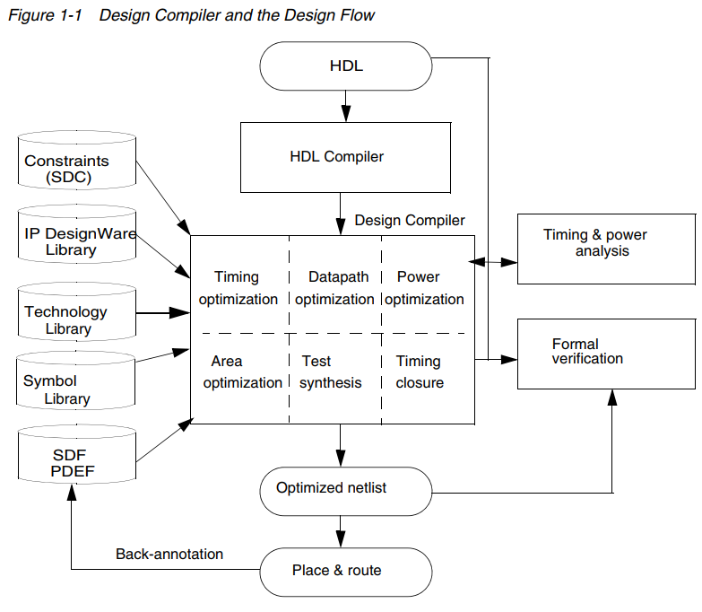

Synthesis
============================

.. toctree::
    :maxdepth: 2
    :caption: Contents:

    ./定义设计环境.rst
    ./综合阶段中的设计约束.rst
    ./综合结果评估.rst

以 Design Compiler 为例，其流程如下：

综合时基于设计约束、设计文件的信息，将RTL模块综合成门级网表，然后对综合出的网表进行评估，检验其是否满足约束条件

.. warning::
    对于整个芯片的综合，其综合过程会与单独的RTL模块的有一定的区别（待查）

参考
------------------------

- Design Compiler® User Guide Version E-2010.12-SP2, March 2011