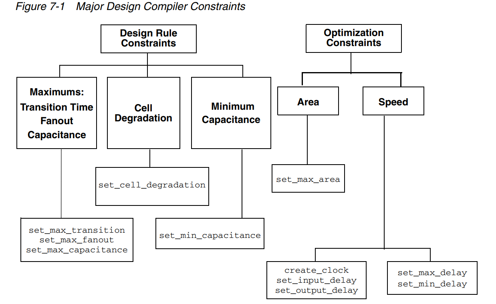

综合阶段中的设计约束
=========================

基于 design compiler 阐述综合阶段的设计约束

When Design Compiler optimizes your design, it uses two types of constraints:

.. warning::
    Design Compiler tries to meet both design rule constraints and optimization constraints, but **design rule constraints take precedence** .

P.S. 上图中没有包含 **功耗方面的约束** ，请参考下文

Design rule constraints
----------------------------

**Design rule constraints** are **implicit** constraints:

- the technology library defines **Design rule constraints**
- **Design rule constraints** are requirements for a design to function correctly
- **Design rule constraints** apply to any design using the library

You can make these constraints **more restrictive** than optimization constraints

+--------------------------+------------------------+
|         Command          |         Object         |
+==========================+========================+
| ``set_max_fanout``       | Input ports or designs |
+--------------------------+------------------------+
| ``set_fanout_load``      | Output ports           |
+--------------------------+------------------------+
| ``set_load``             | Ports or nets          |
+--------------------------+------------------------+
| ``set_max_transition``   | Ports or designs       |
+--------------------------+------------------------+
| ``set_cell_degradation`` | Input ports            |
+--------------------------+------------------------+
| ``set_min_capacitance``  | Input ports            |
+--------------------------+------------------------+

Optimization constraints
-------------------------------

**Optimization constraints** are explicit constraints (you define them), represent speed and area design goals and restrictions that you want but that might not be crucial to the operation of a design. 

Optimization constraints apply to the design on which you are working for the duration of the ``dc_shell`` session and represent the design’s goals. They must be realistic

.. warning::
    Speed (timing) constraints have higher priority than area.

Timing constraints (performance and speed)
^^^^^^^^^^^^^^^^^^^^^^^^^^^^^^^^^^^^^^^^^^^^^^^^^^

- Input and output delays (synchronous paths)
- Minimum and maximum delay (asynchronous paths)

Maximum area (number of gates)
^^^^^^^^^^^^^^^^^^^^^^^^^^^^^^^^^^^^^^^^^^^^^^^^^^

面积约束

功耗约束
^^^^^^^^^^^^^^^^^^^^^^^

If you use the **Power Compiler** tool from Synopsys,  ``max_dynamic_power`` and ``max_leakage_power`` are optimization constraints. 