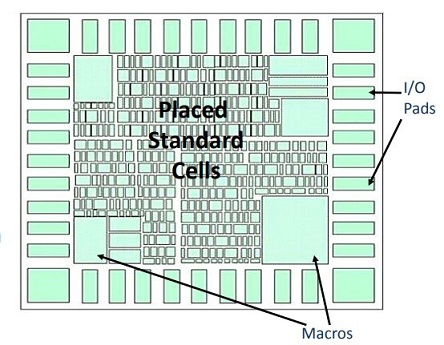

Placement
========================

由于 I/O pad cell、macro 的布放都在布图规划时已经完成，对于 **展平式布局** 而言，Placement 的剩余任务主要是对标准单元的布局

Placement is the process of placing standard cell in the design, The tool determines the location of each standard cell on the die.

- place the standard cells available in the synthesized netlist
- optimizes the design
- determines the routability of design.

Placement will be driven by different criteria like **timing driven** ,  **congestion driven** and  **power optimization**

.. warning::
    The goal is to **minimize the total area and interconnect length**

.. toctree::
    :maxdepth: 3
    :caption: Contents:

    ./布局过程与算法.rst
    ./布局方案评估.rst
    ./层次化布局.rst